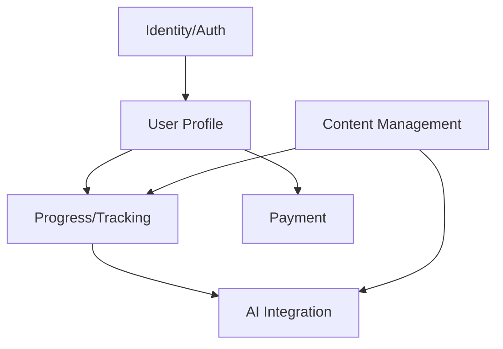

# Backend Modules Design - BabyFirst

This document outlines the high-level module architecture for the BabyFirst Backend system. Each module is designed to be autonomous with clear boundaries.

## 1. Identity & Authorization Module
- **Purpose**: Manage system access, security, and identity.
- **Responsibilities**:
    - User Authentication (JWT).
    - User Registration.
    - Role-Based Access Control (RBAC) - [Parent, Admin, Student].
    - Password Hashing & Security Policies.
- **Boundary**: Does not depend on business modules. Other modules depend on its identity context.

## 2. User Profile Module
- **Purpose**: Manage detailed information about Parents and Admins.
- **Responsibilities**:
    - Parent profile management.
    - Child/Learner profile management (linked to Parent).
    - Account settings and preferences.
- **Boundary**: Linked to Identity via `UserId`.

## 3. Content Management Module
- **Purpose**: Repository for all educational materials.
- **Responsibilities**:
    - Course management (Hierarchy: Catalog -> Course -> Lesson -> ContentItem).
    - Support for multiple content types: Video, Article, Interactive Video, Quiz.
    - Metadata and tagging for AI search/recommendation.
- **Boundary**: Independent. Used by Progress and AI modules.

## 4. Progress & Tracking Module
- **Purpose**: Record and analyze learner activities.
- **Responsibilities**:
    - Track lesson completion.
    - Store quiz scores and feedback.
    - Time-spent tracking.
    - Progress reporting API.
- **Boundary**: Depends on User and Content modules.

## 5. Payment Module (Future)
- **Purpose**: Handle subscriptions and transactions.
- **Responsibilities**:
    - Stripe/Paypal Integration.
    - Subscription status tracking.
    - Invoice/Billing history.
- **Boundary**: Isolated. Interacts with User module to verify access.

## 6. AI Integration Module (Placeholder)
- **Purpose**: Provide AI-driven insights and personalization.
- **Responsibilities**:
    - **Interface-based**: No hard dependency on specific LLMs.
    - AI Content Analysis (Auto-tagging).
    - AI Recommendation Engine (What to learn next?).
    - Learning Path generation.
- **Boundary**: Consumes data from Progress and Content modules.

---

## Module Interaction Diagram (Conceptual)

